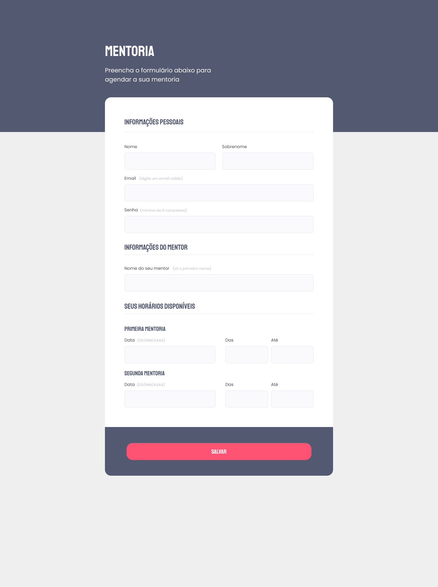

<h1 align="center"> Stage 03 - Desafio 01 - EXPLORER </h1>

Desafio  desenvolvido para conclusão do Módulo 01/Stage03 do curso Explorer - Criando formulários 

  <a href="#-tecnologias">Tecnologias</a>&nbsp;&nbsp;&nbsp;|&nbsp;&nbsp;&nbsp;
  <a href="#-projeto">Projeto</a>&nbsp;&nbsp;&nbsp;|&nbsp;&nbsp;&nbsp;
  <a href="#-layout">Layout</a>&nbsp;&nbsp;&nbsp;|&nbsp;&nbsp;&nbsp;
 

 

  

## 🚀 Tecnologias

Esse projeto foi desenvolvido com as seguintes tecnologias:

- HTML e CSS
- Git e Github
- Figma

## 🔖 Layout

O layout do projeto foi desenvolvido pelos instrutores da Rocketseat como parte do material de estudos do curso Explorer. 

## 🪪 Licença

Esse projeto está sob a licença MIT.

 

Feito com ♥ by Thalyta Rangel
